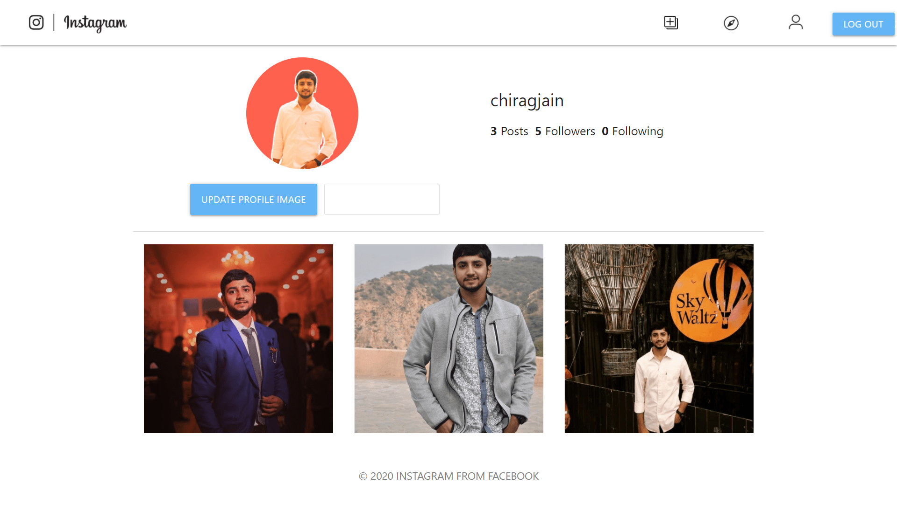

# Instagram Clone

## 📌 Introduction
This is the clone of Instagram Social Media Channel (by Facebook). You can share your images with your followers and engage with their posts too!

This Project has been created solely for the educational purpose to learn some concepts in MERN Stack Development.

### 🌐 Live Project - https://instagram-webapp.herokuapp.com/

## 🏁 What I had learned?
- React.js
- Node.js
- MongoDB
- JWT Based Authentication
- Deployment on Heroku

## 🔑 Key Features

- Login / Register using your email
- Follow or unfollow the users
- Like, Comment or Post Images
- Update Profile Image

### Upcoming Features to be added

- Search Users
- Reset Password
- Responsive Website

## ⭐ How to get started on local system?
1. Drop a ⭐ on the Github Repository.
2. Clone the Repo by going to your local Git Client and pushing in the command:
git clone https://github.com/mechiragjain/Instagram-Clone.git
3. Now, push in the command under Instagram-Clone/Server directory which will install all the dependencies of the project:
npm install
4. Run this command to start the backend of the application:
node app.js
5. Now, head over to 'client' directory and run this command to start the frontend of the application: npm start
